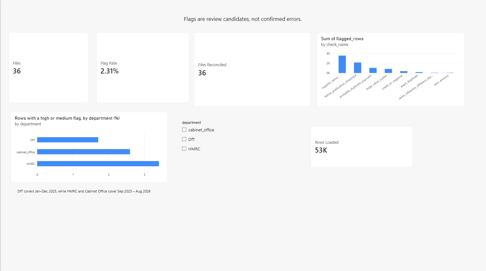
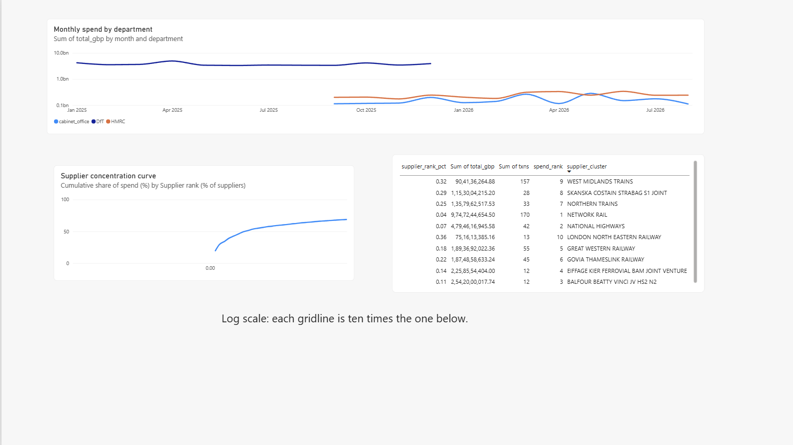
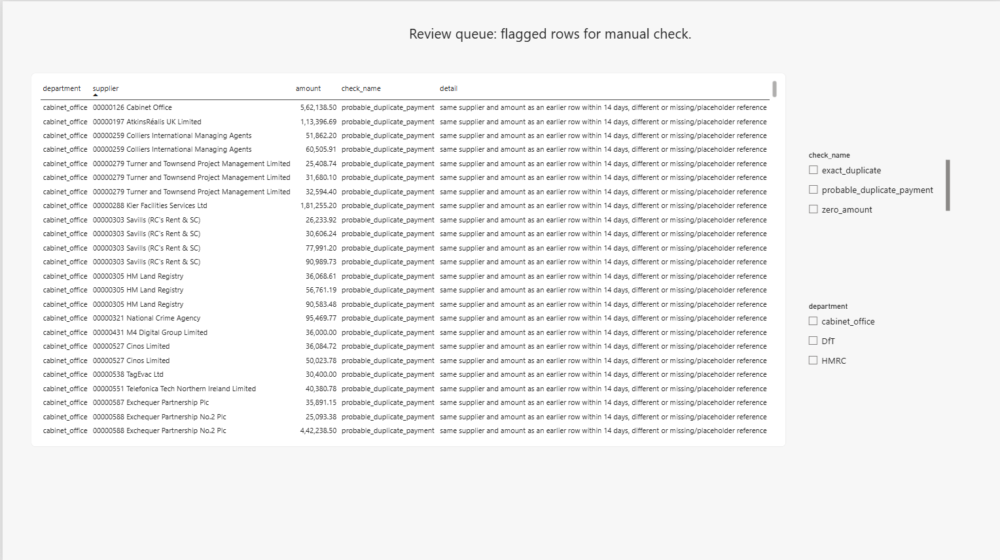

# UK Government Spend: Data-Quality & Reconciliation Pipeline

A pipeline that takes the **real, messy "spend over £25,000" files** that UK government
departments publish every month, forces them into one clean schema, proves that no rows were
lost, and flags data-quality problems for review.

**Why this project exists:** every department publishes the same kind of data with different
column names, encodings, delimiters, date formats and amount formats. Cleaning that reliably,
and *proving* the result is complete, is the core of data-quality and reconciliation work.

## Results (real data)

- **Scope:** 3 departments (DfT, HMRC, Cabinet Office), 36 files, 52,703 rows, January 2025 to mid-2026
- **Reconciliation:** all 36 files reconciled (rows read = rows loaded + rejected, and control totals match)
- **Flag rate:** 2.31% of rows flagged as review candidates, not confirmed errors
- **Hand check:** a 15-row sample traced to the raw files. 8 real issues (all 7 exact duplicates and the zero-amount row), 2 false alarms, 5 unresolved. Probable-duplicate flags were the noisiest rule.





More: [docs/CASE_STUDY.md](docs/CASE_STUDY.md) | [docs/quality_report.md](docs/quality_report.md) | `UK_Gov_Spend_Quality.pbix`

The code and its 15 unit tests also pass on a small synthetic fixture (used for testing only).

---

## What it does

| Stage | What happens | Where |
|---|---|---|
| Ingest | Detects encoding (UTF-8 / cp1252 / latin-1) and delimiter, finds the header row below any preamble, maps differing column names to one schema, keeps the source file and row number for every record | `src/spendqa/ingest.py` |
| Clean | Parses `£1,234.50`, `(1,234.50)`, `1,234.50-`, `CR` amounts; parses 18 date formats (UK day-first) and Excel serial dates; rejects only non-transactions (total lines, unparseable amounts), each with a reason | `ingest.py` |
| Check | Missing fields, zero/negative/below-threshold amounts, implausible dates, dates far from the file's month, exact and probable duplicate payments, supplier-name variants, statistical outliers | `src/spendqa/checks.py` |
| Load | SQLite database (zero setup), indexed | `src/spendqa/pipeline.py` |
| Reconcile | Per file: rows read = rows loaded + rows rejected, and control totals match between parsing and the database | `pipeline.py` → `reconciliation` table |
| Analyse | SQL views using CTEs and window functions (`LAG`, `RANK`, running `SUM`) for month-on-month spend, supplier concentration, flag summaries | `src/spendqa/sql/analysis.sql` |
| Report | Power BI-ready CSVs, three charts, and a findings report where every number is computed from the data | `src/spendqa/report.py` |

## Quick start

```bash
pip install -r requirements.txt
python -m unittest discover -s tests -v           # 15 tests
python tests/fixtures.py data/sample              # tiny synthetic fixture
python run_pipeline.py --raw data/sample --out outputs_sample   # smoke test only
```

## Reproduce it on real data

1. Go to **data.gov.uk** and search "spend over £25,000". Pick departments that publish it
   (for example Cabinet Office, Department for Transport, HMRC). All are under the Open Government Licence.
2. Download the monthly CSVs for each department.
3. Put them in `data/raw/<department_name>/` (one sub-folder per department; the folder name becomes the department).
   Some departments publish `.xlsx`; those work too. Convert `.ods` or HTML to CSV first.
4. Run:
   ```bash
   python run_pipeline.py --raw data/raw --out outputs
   ```
5. Open `outputs/quality_report.md`, then:
   - Check the **"Files processed … failed"** line and the **"Columns not mapped"** section. Add any new
     header names to `config/column_aliases.json` and re-run until every file loads.
   - Check `outputs/powerbi/reconciliation.csv`: every file should show `reconciled = True`.
   - Inspect `outputs/powerbi/review_queue.csv` and verify flagged rows against the original files
     (`make_hand_check.py` draws a sample for this).
6. Load `outputs/powerbi/*.csv` into Power BI to rebuild the dashboard.

## Design decisions and known limitations

- **Day-first dates** are assumed for ambiguous `dd/mm` values (UK data). A file using US order would be mis-parsed.
- **Supplier clustering** normalises case, punctuation and legal suffixes, then merges names with
  difflib similarity ≥ 0.92 within blocks sharing the first four characters. Spellings that
  differ in their first four characters are not merged. Two different companies with very similar
  names could be merged.
- **Probable duplicates** use a 14-day window. Recurring legitimate payments (rent, framework
  contracts, regular batches) trigger many false alarms. That is why they are labelled "review candidates".
- **Outlier check** is a robust z-score on log amounts per department and is only a screening aid.
- **Filename-derived month** is used for the "date outside file period" check, and only when the filename contains a recognisable month.
- Files that fail header detection are reported in the `files` table, not skipped silently.

## Possible extensions

1. **PostgreSQL port:** load `spend` into PostgreSQL and run `analysis.sql` there (standard CTEs and window functions; minor syntax changes only).
2. **dbt-style tests:** express the checks as SQL tests (unique, not null, accepted range).
3. **Cloud warehouse:** load the CSV outputs to BigQuery and rebuild the views there.
4. **Supplier exception list** for regular repeat payments, to cut probable-duplicate false alarms.

## Project layout

```
config/column_aliases.json   header-name mapping (extend this for new departments)
src/spendqa/ingest.py        reading, parsing, cleaning
src/spendqa/checks.py        data-quality checks
src/spendqa/pipeline.py      orchestration, loading, reconciliation
src/spendqa/report.py        CSV exports, charts, markdown report
src/spendqa/sql/analysis.sql SQL views
tests/                       unit and end-to-end tests (synthetic fixture)
run_pipeline.py              command-line entry point
make_hand_check.py           draws a sample of the review queue for manual checking
fill_hand_check.py           looks sample rows up in the raw files
docs/CASE_STUDY.md           results, hand check and limitations
docs/quality_report.md       generated findings report
UK_Gov_Spend_Quality.pbix    Power BI dashboard
```

## Licence

Code: MIT (see LICENSE).
Data: UK government departments, Open Government Licence v3.0.
